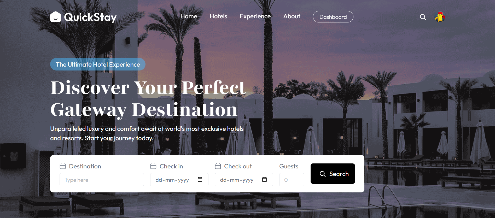
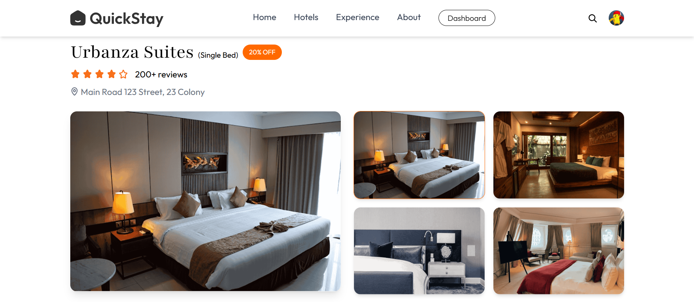
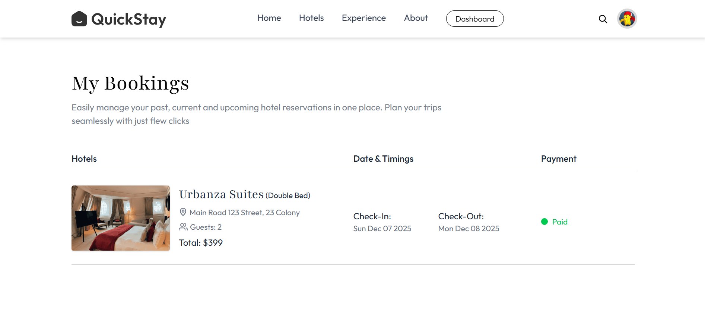
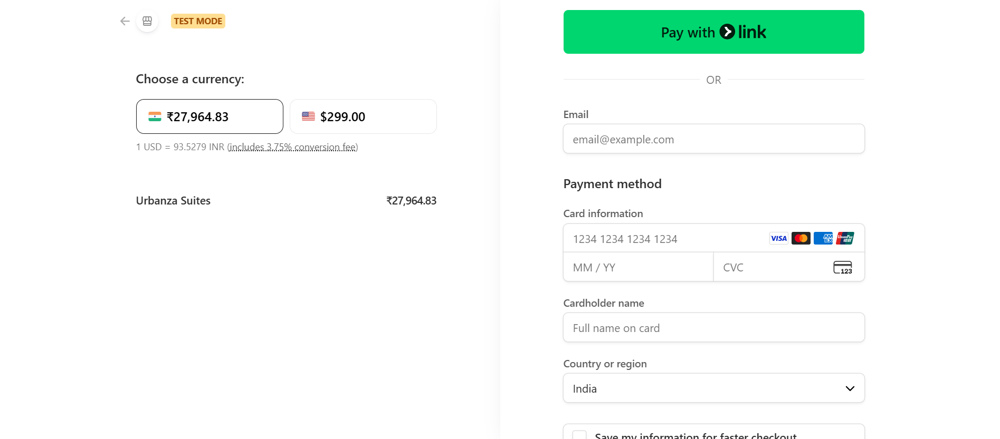
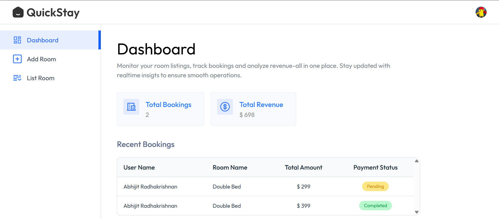

# 🌐 QuickStay – Full Stack Hotel Booking Platform

QuickStay is a production-ready full-stack hotel booking system that enables users to explore rooms, check real-time availability, complete bookings with **Stripe**, and manage reservations.

Admins/Owners can add hotels, manage rooms, track bookings, view revenue analytics, and monitor customer activity.

This project is ideal for:

- Portfolio demonstration

- Real-world **MERN** application learning

- Authentication + Payments + Cloud Storage example

- Scalable project structure reference

🔗 **Live Demo (Frontend):** https://quickstay-dun-xi.vercel.app/  
🔗 **Backend API (Live):** https://hotel-booking-backend-ashen-eight.vercel.app/

---

## 📌 Table of Contents

- [Project Overview](#project-overview)
- [Features](#-features)
- [Tech Stack](#-tech-stack)
- [System Architecture](#system-architecture)
- [Screenshots](#-screenshots)
- [Environment Variables](#-environment-variables)
- [Folder Structure](#-folder-structure)
- [API Endpoints](#-api-endpoints)
- [Payment Integrastion Details](#-payment-integration-details)
- [Installation & Setup](#installation--setup)
- [Dashboard Overview](#-dashboard-overview)
- [Future Enhancements / Roadmap](#-future-enhancements--roadmap)
- [Contributing](#-contributing)
- [Troubleshooting](#-troubleshooting)
- [Author & Contact](#author--contact)

---

## Project Overview

**QuickStay** is a full-stack hotel booking web application built with the **MERN stack**, designed to simulate real-world booking platforms with secure payments, role-based dashboards, and scalable architecture.

---

## 🚀 Features

### 🧑‍💼 User Features

- 🔐 **User Authentication (Clerk)**
- 🏨 **Browse, search & filter hotels**
- 🎯 **Advanced filters** (price, category, AC/Non-AC, capacity, availability)
- 📅 **Real-time room availability check**
- 🛏️ **Instant booking system**
- 💳 **Stripe payment integration**
- 📜 **Booking history** with statuses & details
- 📧 **Email confirmation** on successful booking
- 🖼 **Cloudinary-based image delivery**
- 🚫 **Auto-hide deleted rooms from booking history**

---

### 🏨 Owner/Admin Features

- 🏢 **Register hotels & manage listings**
- 🏘 **Add, edit & delete rooms**
- 📊 **Analytics Dashboard** (total revenue & bookings)
- 👤 **View all customer bookings**
- 📤 **Cloudinary image uploads**
- ⚠️ **Auto-hide deleted rooms app-wide**

---

## 🧰 Tech Stack

### **Frontend**

- React.js
- Tailwind CSS
- AppContext (Global State Management)
- Axios
- React Router
- Clerk Authentication

### **Backend**

- Node.js
- Express.js
- MongoDB + Mongoose
- Stripe Payments
- Cloudinary (images)
- Multer (uploads)
- Nodemailer (emails)
- CORS

---

## 🏗️ System Architecture <a id="system-architecture"></a>

```
React (Frontend)
        ↓ Axios
Express API (Backend)
        ↓
MongoDB (Data Layer)
        ↓
Stripe (Payment Gateway)
Cloudinary (Image Storage)
Clerk (Authentication)
```

---

## 📸 Screenshots

### Homepage



### Room Details



### Booking Page



### Stripe Checkout



### Dashboard



---

## 🔑 Environment Variables

### Frontend (.env)

```env
VITE_CLERK_PUBLISHABLE_KEY=
VITE_BACKEND_URL=
VITE_CURRENCY=$
```

### Backend (.env)

```env
# Clerk keys
CLERK_PUBLISHABLE_KEY=
CLERK_SECRET_KEY=
CLERK_WEBHOOK_SECRET=

# Cloudinary
CLOUDINARY_CLOUD_NAME=
CLOUDINARY_API_KEY=
CLOUDINARY_API_SECRET=

# NodeMailer SMTP - Brevo
SENDER_EMAIL=''
SMTP_USER=''
SMTP_PASS=''

# Stripe
STRIPE_PUBLISHABLE_KEY=
STRIPE_SECRET_KEY=
STRIPE_WEBHOOK_SECRET=
```

---

## 📦 Folder Structure

```
QuickStay/
│
├── client/                 # React Frontend
│   ├── src/
│   │   ├── components/
│   │   ├── context/
│   │   │   └── AppContext.jsx
│   │   ├── pages/
│   │   ├── utils/
│   │   └── App.jsx
│
└── server/                 # Node.js Backend
    ├── configs/            # DB, Cloudinary, etc.
    ├── controllers/
    ├── models/
    ├── routes/
    ├── middleware/
    └── server.js
```

---

## 🧪 API Endpoints

### Auth

| Method | Endpoint         | Description       |
| ------ | ---------------- | ----------------- |
| GET    | /api/auth/verify | Verify user token |

### Rooms

| Method | Endpoint       | Description   |
| ------ | -------------- | ------------- |
| GET    | /api/rooms     | Get all rooms |
| POST   | /api/rooms/add | Add new room  |
| DELETE | /api/rooms/:id | Delete room   |

### Bookings

| Method | Endpoint              | Description       |
| ------ | --------------------- | ----------------- |
| POST   | /api/bookings/create  | Create booking    |
| GET    | /api/bookings/:userId | Get user bookings |

### Payments (Stripe)

| Method | Endpoint               | Description                    |
| ------ | ---------------------- | ------------------------------ |
| POST   | /api/payments/checkout | Create Stripe Checkout Session |

---

## 💳 Payment Integration Details

**Currently Supported:**

- ✔️ Stripe Checkout (fully implemented)
- ✔️ Handles:
  - Payment success
  - Payment failure
  - Post-payment booking updates

---

## 🛠️ Installation & Setup <a id="installation--setup"></a>

### Frontend

```bash
cd client
npm install
npm run dev
```

### Backend

```
cd server
npm install
npm run server
```

---

## 📊 Dashboard Overview

Dashboard includes:
| Metric | Description |
| ---------------- | ------------------------ |
| Total Bookings | Count of all bookings |
| Total Revenue | Sum of all paid bookings |
| Recent Bookings | Latest 10 bookings |
| Room Management | Add/Edit |
| Photo Management | Cloudinary upload |

#### Updates automatically after bookings & payments.

---

## 🚀 Future Enhancements / Roadmap

### Backend

- Razorpay integration
- JWT refresh tokens
- Admin/Owner roles

### Frontend

- Wishlist / Favorites
- PWA support
- Infinite scroll

### Dashboard

- Revenue chart
- Hotel comparison
- Occupancy analytics

---

## 🤝 Contributing

```bash
git clone https://github.com/vijay0984567/QuickStay.git
git checkout -b feature-name
git commit -m "Added new feature"
git push origin feature-name
```

Open a Pull Request ✔

---

## 🐛 Troubleshooting

### Images not uploading

✔ Check Cloudinary keys

### Stripe checkout failing

✔ Ensure webhook secret is correct

### Dashboard showing 0 values

✔ Check if isPaid is updated properly

---

<h2><a class="anchor" id="author--contact"></a>Author & Contact</h2>

**Vijay Kumar**  
MERN Stack Developer  
📧 Email: vijaykumar0984567@gmail.com  
🔗 [LinkedIn](https://www.linkedin.com/in/vijay0987/)
